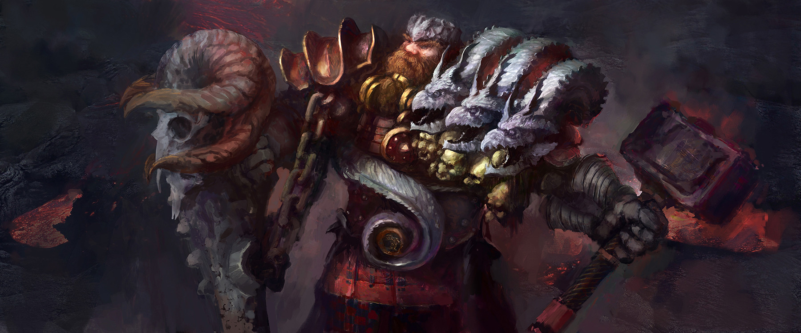

# Astrid Whitford d'Cannith

Astrid inherited the title of Marquess from his father, but rumor has it that the late Starrin d'Cannith was about to strip him of the title because of the treatment he has engendered toward the hobgoblins and other races he has oath bound.
Astrid is enamored with the story of Jamekin and the war he fought in. Always looking for a fight, Astrid uses the Whitford family as an enforcer arm with House Cannith, mostly in support of Zorlan d'Cannith, who he supports as the next family head.
