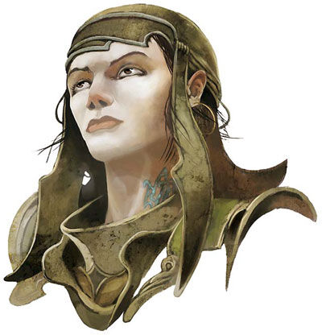

# Jorlanna d'Cannith

Jorlanna d'Cannith is a Duchess of House Cannith. Jorlanna d'Cannith is a proud and attractive woman in her fifties. She is closer to the age of a matriarch than her rivals. Her claim is stronger than Merrix's as she is the daughter of the last leader of the house's second wife, Elsabet. However, she is also considered least likely to claim the House's leadership. Though she has a strong passion for uniting the House, allies in the Twelve, and a personal magnetism, people do not trust her judgment because of her past history.

When Jorlanna was younger, she fell in love with an heir of House Deneith. The Houses removed both lovers from public for a year when this liaison was discovered. Many believe that during this sequestration, there was an issue from the affair. When she came back from seclusion she was alone. This event has haunted her since and, if the rumor of pregnancy is true, for good reason.
