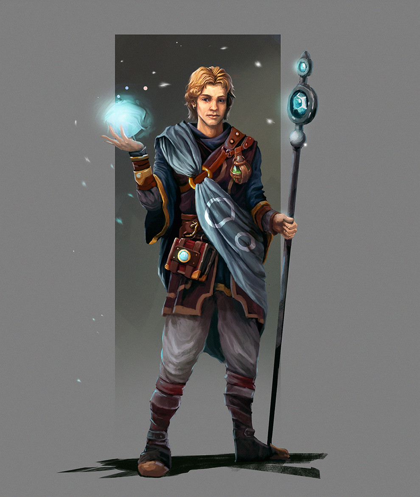

# Norran d'Cannith

The only son of former Cannith patriarch Starrin d'Cannith, Norran died along with his father on the Day of Mourning in Cyre. Norran was the only direct descendant of Starrin and next in line to rule House Cannith, but Norran had fathered no children himself. With his death the house fell into chaos as to who would rule in his stead.
