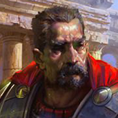

# Starrin d'Cannith

Starrin d'Cannit*, called "the Gorgon" both for his house's symbol and his intimidating nature, was the last patriarch of House Cannith. He perished at the house's Eston enclave in Cyre on the Day of Mourning. Normal procedure would have the patriarchs named successor or direct descendant take the role. However, Starrin had never declared an heir and his only son, Norran d'Cannith died with his father in Cyre and left no children of his own to pass on the line. No decision could be made as to who was the rightful heir. With the house in disarray and with so many high-ranking officials suddenly dead, no one still within the house could come to a fair or just vote. Three rivals within the house each rose to claim the title, each one seeking to rule the powerful house.
Merrix d'Cannith now controls Cannith South and though he is the youngest of the three and has the weakest familial connection to Starrin, his rivals are wary of his incredible talents as an artificer and his driving ambition. 
Jorlanna d'Cannith rules Cannith West and has the strongest family tie to Starrin, being a direct descendant of Starrin and his second wife Elsabet. However, Jorlanna is plagued by a scandelous past, and despite her many allies both Merrix and Zorlan do not believe she has enough will or influence over the people of the house to take leadership.
Zorlan d'Cannith presides over Cannith East and is well known for being a prudent businessman as well as a capable advisor to the late Gorgon. Zorlan has powerful allies in Karrnath but this may also be his biggest hindrance, as some within the house feel he has become jaded by Karrnathi influence.
