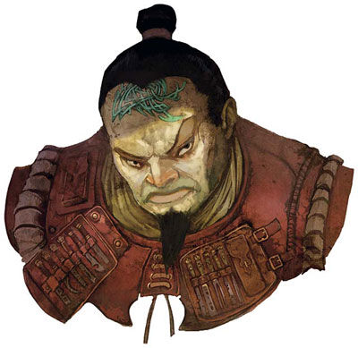

# Zorlan d'Cannith

Zorlan d'Cannith is a Duke of House Cannith. He was a trusted advisor to the Gorgon, thanks to his financial skill and knack for making a profit.

A cousin to the former leader of the house, Starrin d'Cannith, Zorlan was raised in Cyre and relocated to Korvhall when that nation ordered its first warforged from House Cannith. Taking up residency, he acted as both emissary of the House and advisor to King Kaius II, consolidating Cannith's influence. He utilized profitable contracts with the Mror Holds and the Lhazaar Principalities to perpetuate the House's profit, and in so doing became an advisor to the Gorgon. His leadership turned Cannith operations in Korvhall from a mere outpost to a profitable and prestigious venture.

The man is well known for his shrewd manner and mind for business. Indeed, Zorlan's skills are contrasted by a cold and callous attitude that disturbs many of his fellows in House Cannith. Some of them dread that his ambition has caused him to deal with disreputable groups. Rumors abound that he has fallen in with the Blood of Vol in an attempt to gain further power, and indeed, he has proven a devout follower, with aspirations to join cult's lay clergy, and even conducting services himself for members of the house from time to time.
