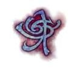

# Dragonmarks
Dragonmarks are said to be the physical manifestations of a Draconic Prophecy. They are more intricate than a birthmark and more distinct than a tattoo. There are twelve families of dragonmarks; originally there were thirteen, but no living creature on Eberron possesses the destroyed mark of House Vol. In addition to being a status symbol in Khorvaire, the dragonmarks provide the bearer with magical talents. [House Dragonmarks](./dragonmarks.png)

## History
The first dragonmark to appear was in house Vol. It is said that House Vol befriended an ancient dragon who bestowed upon them a mark of their treaty, granting them power as well. Though whether the mark was a blessing or a curse upon the clan is still debated today, the power and effect it had upon the region cannot be understated. Still others believe the whole dragon story to be hogwash, that it was really a powerful wizard or the head of the vol clan himself that created the mark. And the story about a dragon was merely a way to not share it.

Today dragonmarks are a part of daily life, even if not everyone has one. Most of the power of the dragonmarks has been solidified into 13 houses that possess a defined dragonmark. Dragonmarks exist outside these 13 houses, but they are regarded as abberant dragonmarks. Lost heirs, bastard children, the outcasts of the families.

## Aberrant Dragonmarks
Aberrant Dragonmarks can be clearly distinguished from a standard house dragonmark and no two are alike

The dragonmarks are passed through bloodlines and when two members of different dragonmarked families reproduce it often results in aberrant dragonmarks. The aberrant marks do not manifest identically each time therefore it is possible for two individuals with completely different looking marks to produce the same magical effect using the mark. Indeed, each aberrant dragonmark is completely unique to its bearer. Those who are aberrant marked are seen as outcasts and outsiders. Often they were shunned by the houses and eked out a pitiful existence. Many members bearing these aberrant dragonmarks have since united in their differences and formed a 14th house, House Tarkanan, most notably present in Sharn.

## Manifestations
Dragonmarks typically appear in the bearer's adolescence as they pass through puberty, however, this is not exclusively the case. There are three distinct manifestations of each dragonmark that correlate in size, intricacy, and power. As the dragonmark gains power (from least to greater) it will expand in size and complexity rather than forming a different mark. Often the mark will manifest first as the least mark and through study and focus the bearer increases their power and with this increase, the dragonmark also increases granting additional abilities. However, there are some who will manifest a lesser mark or even greater mark without explanation. House members who manifest even the least dragonmark, however, can expect at least some change in their lifestyle as they find new and better employment opportunities within their house guilds as well as new social avenues to explore.

#### Measuring Marks
A marks power can be measured in two ways. by it's size and by it's intricacy. The intricacy of the mark shows how advanced the mark is, roughly translating to how many things the mark can do or what scale of effect it could accomplish. A simple Mark of Healing could heal a gash wound for example, but a more complex one might has the ability to extend life for example. Conversely the size of the mark represents the absolute power the mark can wield. A small Mark of Healing might only heal a single person whereas a large onw could heal a small village.

#### Increase in Power
There are two ways to increase a marks power, by study and training, or by defeating another who has a mark and absorbing there's. Absorbing other marks is the much faster method of amassing power, but it comes with several downsides. The first and most obvious being that most houses won't take kindly to their members marks being stolen. And second, while the size of the mark may increase, the complexity of the mark does not seem to. These two things combined have led many to not seek this as a primary means of increasing their marks power, though some still attempt this path from time to time.

## Heir of Siberys
Much rarer are the so-called Heirs of Siberys who possess the Siberys Mark, marks that cover much, if not all, of their body. Siberys Marks are named after the progenitor dragon Siberys. A dragonmarked individual might labor all of their life and never manifest the Siberys Mark, while an unmarked member of a house bloodline might suddenly manifest the mark overnight. It is unpredictable and unexplained despite steady research by top minds across Khorvaire. The Siberys Mark grants the bearer extraordinary power based upon which house's mark they manifest. These Siberys dragonmarks can lead otherwise unknown or undiscovered members of a house to suddenly rise in importance within their own ranks and those who were formerly unmarked may have a hard time adjusting to this new fame.
