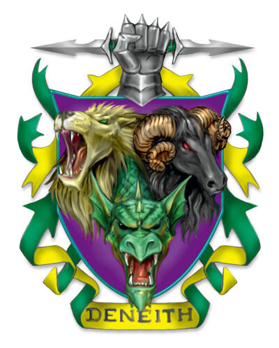

## House Deneith
House Deneith are highly acclaimed mercenaries and bodyguards known for their efficiency and martial skill. Deneith are the muscle of the dragonmarked houses, providing raw power to a nation's army. Taking sides is bad for business, so during the Last War, Deneith remained neutral and provided soldiers to all sides. Now that the war has ended Deneith members are hired for guarding monarchs and chasing down criminals.

## Dragonmark
House Deneith possesses the Mark of Sentinel. This mark has allowed Deneith to become a mercenary powerhouse as it grants martial abilities.

## History
House Deneith were once just a militant noble family in the north eastern area of Antiga around the time the first humans began to manifest dragonmarks in -2600. With the Mark of Sentinel empowering their military might, Clan Deneith waged a campaign of conquest throughout the western region of what is now known as Korvhall. In the end, it was only famine that prevented them from creating an empire out of Korvhall. Though not a member of the house, Karrn the Conqueror was born in clan Deneith's homeland and so during his rise to power Deneith pledged fealty to him. When Galifar I united the five nations in 1 YK, he ordered Deneith to protect his new unified empire.

### The Last War
Deneith earned its status as a mercenary house during the war by offering soldiers from its Blademarks guild to all nations. It carefully contracted its soldiers by selecting battles to ensure no Deneith forces would clash against each other. During the war, a Cyran general ordered his Deneith troops to assault a garrison guarded by other Deneith soldiers. The general became infuriated when the mercenaries refused his orders and retaliated by ordering Cyran troops to attack the Blademark "traitors". The Cyran troops were defeated as the Cyran-hired Deneith troops banded together with their comrades at the garrison. During the war, Deneith and House Ghallanda put together a tactical alliance wherein Deneith troops were followed by Ghallanda members who provided them with food and shelter.

House Deneith once showed no interest in the political side of the Dragonmarked Houses, Since the end of the war, it has become confrontational with House Cannith and House Tharashk. The reason for this is simply business: Deneith see House Cannith's warforged and House Tharashk's monstrous mercenaries as potential replacements of their soldiers for hire.

## Business
Deneith provides mercenaries and guards for hire to anyone who pays. The sentinel marshals act as a form of law enforcement. They currently provide guards for all the crowned heads of the five nations, a large percentage of the nobility, and key members of the other Dragonmarked houses. They are also entitled to stewardship and guarding of Thronehold. This hold over power has led to some members of Deneith calling for a Deneith dynasty or a new Galifar, this idea is referred to as the dark dream of conquest, an idea Baron Breven is completely opposed against.

Now that the war has ended, monstrous races are allowed within cities, providing they obey the law. These monstrous races prefer to sign up with House Tharashk who are perceived as more monster-friendly than House Deneith. This has caused a rivalry between the houses as Deneith wishes to wrestle the favour of monstrous races out of Tharashk's hands. These two houses never admit to open conflict with each other, but acts of sabotage and assassination happen on a regular basis.

There is also some competition from House Medani as they too provide body guards though, since Medani is a relatively small house it has yet to cause any real problems for Deneith and so the houses do not directly compete. It is said that when you're expecting to be attacked you hire Deneith and when you believe someone is plotting against you though, you're unsure who, you hire Medani.

## Key Locations
Karrlakton
Sentinel Tower
Graywall Outpost
Rhukaan Draal Enclave

House Deneith has major enclaves in each of the five nations..

## Guilds
Blademarks Guild
Defenders Guild
Sentinel Marshals
