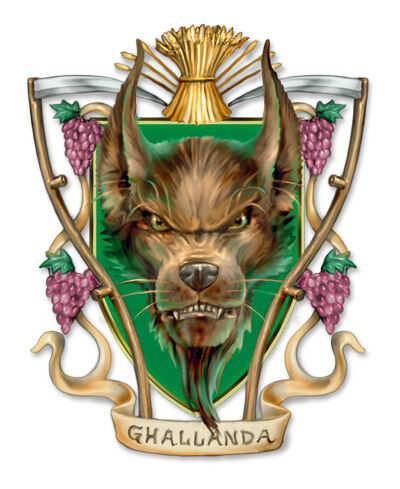

## House Ghallanda
House Ghallanda is one of the few Dragonmarked Houses that are not involved with some form of arms dealing or soldiering, instead Ghallanda are Eberron's best hosts dealing in food and shelter.

## Dragonmark
House Ghallanda bears the Mark of Hospitality. This mark grants various magical benefits that allow its bearers control over food and shelter, giving Ghallanda an advantage in all areas related to hospitality.

## History
The mark of hospitality first appeared over 3000 years ago on the native halfling tribesmen and women of the Talenta Islands. Those who bore this mark tended to congregate together and chose to call themselves Ghallanda. The Ghallandas wandered Eastern Korvhall, travelling from outpost to oasis, they offered food and shelter to all those who crossed their path. During their travels they managed to end feuds, prevent conflicts such as monster and bandit raids and generally ease tension wherever they visited.

When Karrn the Conqueror finally explored the Talenta Plains, the other dragonmarked houses discovered the Ghallandas. After much negotiation the Ghallandas were recognised as a fully fledged dragonmarked house and not long after House Ghallanda began to spread all over Khorvall. They started off small by building humble inns and taverns though, with time they began construction of entire enclaves that dotted the map from Barren Sea to the Lhazaar Principalities.

#### The Last War
House Deneith and House Ghallanda agreed on a contingent during the early years of The Last War for Ghallanda members to follow Deneith soldiers to provide them food and shelter on the field. It wasn't long until the nations' noticed the effectiveness of House Ghallanda and began hiring them to provide the same treatment for their armies. House Ghallanda wished to avoid taking sides and to remain a non-combatant however, when things went wrong they found themselves fighting alongside soldiers on the front lines.

## Notable Members
Baron Yoren d'Ghallanda, Patriarch
Chervina the Architect
Keslo d'Ghallanda

## Business
House Ghallanda offer their customers to spend time at their enclaves, much like a hotel. Under the signing of the Treaty of Thronehold Ghallanda secured concessions freeing their enclaves from the local law, effectively turning them into individual nations. Ghallanda holds no quarrel with their customers, so long as they pay. Anyone who is wanted can escape the law by visitng a Ghallanda enclave.

House Ghallanda also runs taverns and inns throughout Khorvall, all of which hold the Mark of Hospitality. Ghallanda also can contribute to war efforts supplying soldiers with magically created food and shelter.

## Key Locations
Gatherhold, it is believed that A stronghold located on the eastern shore of Lake Cyre.

Ghallanda Hall: Is a form of hotel and sanctuary located in Sharn, it is believed that this hall is host to many fugutives, spies and mysterious strangers than anywhere else in Eberron.

Wandering Inn: Is a nomadic pack of caravans that mimics cruise ships and offers the same luxuries one would find in most Ghallanda enclaves.

## Guilds
Hostelers Guild
Dragontail Guild
Dawn-Builders
