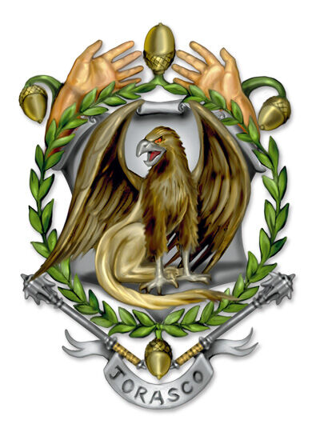

## House Jorasco

## Dragonmark
House Jorasco possesses the Mark of Healing. This mark grants various magical benefits that allow its bearers to heal and cure diseases making Jorasco a vital part of the struggles of the Last War and throughout Korvhall in general.

## History
The Mark of Healing first appeared among the halflings of the Talenta Islands around 3000 years ago. However, unlike their counterparts in House Ghallanda, the halflings of Jorasco have largely abandoned their nomadic tribal roots and become firmly enmeshed in the culture and society of the five nations.

#### The Last War
The Last War was financially good for House Jorasco and they made a fortune healing the soldiers of every nation and army and keeping armies on their feet. However, the end of the war may be even more lucrative as the House of Jorasco extends ongoing care to those injured or permanently disabled during the war.

## Notable Members
Baron Ulara d'Jorasco, matriarch
Ardras d'Jorasco (from Dragonmarked, p. 40)
Diraz d'Jorasco (quoted in Dragonmarked, p. 36)
Janasar (from Sharn: City of Towers, p. 54)
Jode d'Jorasco (from Dreaming Dark novels, by Keith Baker)
Kurala d'Jorasco (from Sharn: City of Towers, pp. 52, 54)
Mala Boromar d'Jorasco (from Sharn: City of Towers, p. 150)

## Guilds
The Healers Guild is the premiere service of House Jorasco. They provide both mundane and magical healing for those who can afford it at their hospitals and healing enclaves throughout Korvhall. Members of the guild include herbalists, alchemists, physicians, as well as some clerics and adepts to the Sovereign Host and Silver Flame. Few seek healing from the church (even if they are willing to pay) and only the most devout or well respected within a religion will usually receive healing.

## Key Locations
#### Major Enclaves
Vedykar, Karrnath ("Resthold", seat of power)
Fairhaven, Aundair
Sharn, Breland
Gatherhold, Talenta Plains

#### Minor Enclaves/Healers' Guild Facilites
Flamekeep, Thrane
Korth, Karrnath
Newthrone, Q'barra
Taer Valaestas, Valenar
Trolanport, Zilargo
Pylas Talaear, Aerenal
Stormreach (Xen'drik)
Additional small offices and clinics across continent
