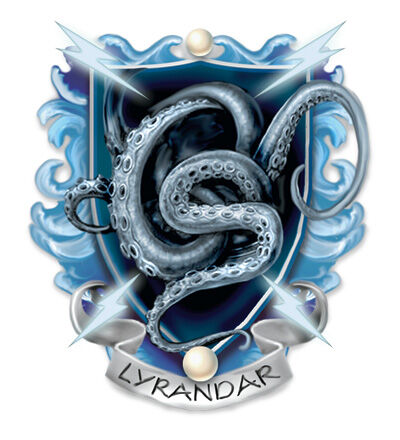

## House Lyrandar
House Lyrandar's enclave is located on Stormhome an island city-state just north of Antiga.

As is common among other dragonmarked houses, Lyrandar is led by a baron (patriarch or matriarch). Some in the house refer to the baron as "Firstborn", believing that Lyran and Selavash, the ancient ancestors of House Lyrandar, speak through that individual.

## Dragonmark
House Lyrandar possesses the Mark of Storm. This mark grants various magical benefits that allow its bearers to control winds and waves.

## History
Although there are no historical records of the beginnings of the house, Lyrandar is said to have begun around 2000 years ago, six centuries after legends hold that the elves first migrated to Korvhall from Aerenal. Lyran and Selavash were the first to develop the Mark of Storm.

#### Last War
At the beginning of the Last War, House Lyrandar was significantly weaker than they are today. Most transport, including military transport (troops and supplies), were carried over land, and Orien with their caravans and trade routes, not to mention the lightning rail, were the carrier of choice for every nation and faction.

Lyrandar, in the early years of the war, made their money primarily in the field of weather manipulation: clearing rainy and muddy regions so troops could pass, using weather to make trade routes impassable (especially if they were Orien trade routes), helping regions in need of a good growing season because of enemy food raids, and whatever else the paying client needed; though Lyrandar were always careful not to violate neutrality.

Orien's trade routes deteriorated as the war went on, and House Lyrandar was there to take up the slack with a fleets of galleons to ship for clients via sea. They also sold ships to clients who could afford them.

House Lyrandar also provided Stormhome as a safe refuge and meeting place for spies.

#### End of the War
Everything changed in 990 YK when, with the aid of Zil gnomes and House Cannith, House Lyrandar produced the first elemental airships. Lyrandar, no longer limited to the seas, could carry troops and supplies across land faster than Orien could hope to do, and the House of the Kraken began to completely dominate the transport industry.

Though they would carry supplies and transport troops for client-nations, but would not use the airships in combat so as not to violate their neutrality. They would, however, sell airships to nations willing to pay for them, though because of the price of the vessels, there was never a brisk trade in airships.

#### Post-War
Unlike some houses, such as Orien and Cannith, who suffered huge losses during the war, Lyrandar completed the war without incurring much loss. And unlike some houses, like Jorasco, Lyrandar's has not suffered much in the way of political backlash for the money they made during the war.

Instead, the nations they served largely credit them with providing weather for crops and preventing droughts, and their airships for giving the post-war economic boost necessary for the five nations to rebuild. Lyrandar's status is now arguably higher than it has ever been, and the future looks bright.

Their relations with certain other dragonmarked houses is not as rosy. Orien, their main competitor, still reeling from the devastation they suffered during the war, and particularly on the Day of Mourning, when they lost thousands of miles of lightning rail lines and the enormous transfer hub at Metrol, are increasingly angered by Lyrandar's encroachment onto what they view as their territory. House Cannith, who provided the initial design work for the airships, feels that it deserves greater compensation and wants a percentage for all airships sold. But while Lyrandar negotiates with these houses, their power and prestige continue to grow with the general populace.

## Relations
House Orien: Most members of House Orien are unfriendly towards those of Lyrandar as the airship threatens to damage Orien's land based transport industry.

## Notable Locations
* Stormhome
* Rhukaan Draal
* Taer Valaestas
Lyrandar maintain smaller offices and docks in other towns and ports across Korvhall, they also hold additional lands in Valenar, in violation of the Korth Edicts. House Lyrandar also have enclaves in Sharn, Korth, Flamekeep, Wroat, Korranberg, Rekkenmark, Stormreach, Trolanport, Thaliost and Zarash'ak.

## Guilds
The Raincallers Guild provides weather management, while the Windwrights Guild is one of the largest air and sea shipping and transit businesses in Korvhall.
