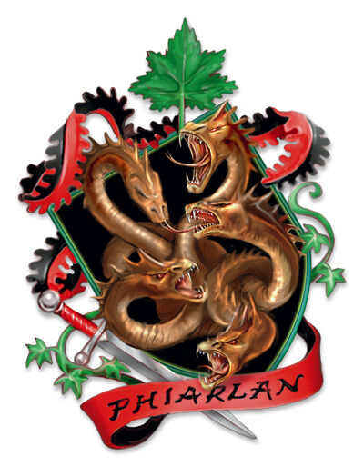

## House Phiarlan
House Phiarlan is a house known throughout Antiga, although they are now based in Sharn, due to their former base of operation in Cyre having been destroyed in the Day of Mourning. To the public Phiarlan is a house of entertainment comprised of bards, actors, artists and acrobats though, in secret it is a house of spies.
House Phiarlan contains both the Entertainers Guild and the Artisans Guild, but they also secretly run the Serpentine Table and the Carnival of Shadows. During the Shadow Schism, a portion of House Phiarlan splintered off to form House Thuranni. House Phiarlan's original headquarters was destroyed in Cyre, and they have not created a new headquarters, preferring to stick to the shadows.

## History
House Phiarlan was one of the first Dragonmarked Houses to be formed. The first members of House Phiarlan were scouts and bards who raised morale and brought news and information to the scattered elven tribes. The Phiarlans traveled between settlements as troubadours and mediators. Over time the Phiarlans mastered the art of trading information and made sure to use the information they had to their advantage.

At the dawn of the Current Age, around -3200 the first dragonmarks appeared, including the Mark of Shadow. During this time the dragons were already at war with the elves and the dragonmarked garnered the suspicion of the dragons. When it was revealed that House Vol was in an alliance with dragons, the War of the Mark began in an attempt to exterminate the House. The elves who carried the Mark of Shadow knew it to be unsafe for the dragonmarked so they fled to Korvhall in an effort to avoid the same fate as House Vol and upon arriving they banded together to form House Phiarlan around -2600. The House's artistic skills earned them a place within the five nations and in time the Serpentine Table offered its expertise to those in power there.

#### The Last War
During the Last War, House Phiarlan offered its services of spying and intelligence to all nations, refusing to side with anyone. Due to House Phiarlan's secrecy and to the fact that they were taking contracts from all sides, eventually House Phiarlan agents found themselves contracted against each other which led to conflicting loyalties. The result was a cataclysmic event for Phiarlan named the Shadow Schism which tore the House apart and led to the creation of Phiarlan's rivals, House Thuranni who themselves, are former members of Phiarlan.

## Iconography
House Phiarlan uses two symbols, the heraldic mark of the hydra and the mask of shadows. The mark of the hydra is the house's primrary symbol and features a five headed hydra along with a blade resting below it. Four of the heads are aggresive looking whilst one is more tame and calm. The symbol represents the artistic divisions within the house and resilience. The less popular symbol, the mask of shadows, is usually worn by members as either literal full sized masks or more subtle badges or jewellery. The mask of shadows is silver in colour and has a stylized design.

## Notable Members
Matriarch Elvinor Elorrenthi d'Phiarlan
Seneschal Taen Shol d'Phiarlan
The Hydra

## Notable Locations
The Five Demesnes
Memory: This Demesnes deals with the written word. Phiarlan novelists, playwrights, and poets all study it. The Phiarlan back a good amount of money thanks to their books, songs and plays because they have a powerful effect on public opinion. So an individual can pay for a Phiarlan author to portray them in a good light or the person can ask them to vilify an enemy. Phiarlan are also used as speech writers and many politicians have hired them to improve their image.

The Demesne of Memory is located in the city of Fairhaven in Aundair.

Motion: As its name suggests this Demesnes has to do with the art of the body. The art form that is studied here is dance, gymnastics, wrestling, mime, contortion, massage, and many more. Phiarlans have master many different forms and styles of dance and they are know for there grace and power. Acrobats of the Carnival of Shadows train in this Demesne before starting in the Carnival. The Serpentine Table normally take some of the most gifted students of motion for their group.

Phiarlan escorts study the arts of motion and shadow. These elves are used for people that need companionship or to make an impression and the Phiarlan can change their appearance through their magic to appear as anyone the client needs or wants.

The Demesne of Motion is located in the city of Wroat in Breland (Dragonmarked 3.5).

Music: This Demesnes teaches the art of sound, song and instruments. This Demesne teaches different styles from all over Eberron. Most Phialan learn this Demesne and it is second in popularity only to the Demesne of Shadow.

The Demesne of Music is located in the city of Flamekeep in Thrane.

Shape: This Demesnes teaches the different ways of making costumes, sets, props and instruments. Aesthetic art, sculptors, painters, and potters also learn this Demesne. The Phiarlan use the worksmithing that they obtained for Aerenal to create the many things.

The first Demesne of Shape was located in the city of Atur in Karrnath but was taken over by the newly founded House Thuranni. House Phiarlan has reestablished the Demesne in the Thrane city of Thaliost. (Dragonmarked 3.5).

Shadow: This Demesne covers the art of deception. The illusions used in the house's various art forms and plays are learned here. This also serves as the center for verbal arts of deception and coercion, feigned emotion, and role assumption.

The Demesne of Shadow is located in Sharn, Breland. The Demense of Shadow was located in Metrol in Cyre, but with Cyre destroyed in the wake of the Day of Mourning the new Demesne of Shadow has been established in Sharn. With the destruction of the first Demesne of Music, it is the oldest of the Five Demesnes and is the current home of the house matriarch.

## Guilds
Entertainers and Artisans Guild
The Serpentine Table
