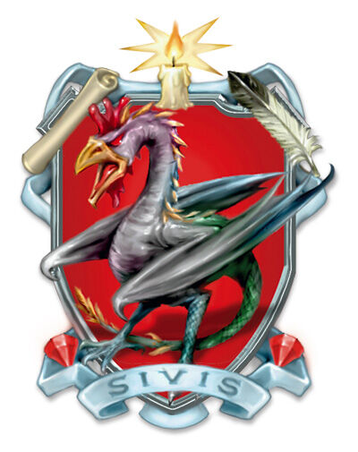

## House Sivis
House Sivis is a house operating throughout Korvhall.

## Dragonmark
House Sivis possesses the Mark of Scribing. This mark grants various magical benefits related to written and verbal communication. It is through the auspices of Sivis that people can communicate with another across Antiga almost instantaneously. House Sivis members also act as translators for diplomats and other dignitaries.

## History
The Sivis dragonmark first appeared around 2800 years ago. The house has carefully cultivated the peoples around them since that time and have remained firmly neutral in all conflicts. So, while most people are suspicious of the devious and conniving nature of gnomes, House Sivis has remained above reproach and their services are now indispensable.

## Leadership
House Sivis is currently governed by a High Council composed of representatives from each of the nations in which the House operates; this council is currently led by Lysse Lyrriman d'Sivis. Lady d'Sivis has led the House for nearly ninety years.

## Membership
While all members of House Sivis are gnomes, not all members carry the Mark of Scribing. House Sivis contains both the Notaries Guild and the Speakers Guild, though anyone working for those guilds is not immediately considered a member of House Sivis. They are based out of Korranberg in Zilargo, but have enclaves across the continent of Khorvaire.

There are twelve families in House Sivis, including Corralyn, Haskal, Lyrriman, Magan, Santor, Severin, Syrralan, Tarlian, and Torralyn. Most members of House Sivis carry the surname "d'Sivis", though the occasional member (especially one dedicated to the research of linguistics) may not.
