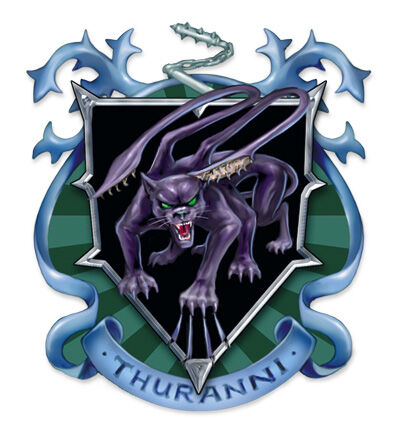

## House Thuranni
House Thuranni is an dragonmarked house which was once a part of House Phiarlan and has become their direct rivals competing in entertainment and espionage. House Thuranni is the youngest of the dragonmarked houses and lives a double life, to the public they are artists, entertainers and beautiful courtiers however, that is far from the truth. House Phiarlan is still larger and stronger than House Thuranni, leading the way in information gathering and spying however, there is one field that House Thuranni surpasses their cousins, assassinations.

## Dragonmark
House Thuranni possesses the Mark of Shadow that grants various magical benefits that relate to divination and illusions.

## History
During the early years of the Last War House Thuranni's members were still a part of House Phiarlan and carried out many assassination contracts. The Thuranni family were mainly based in north-western Korvhall and much of its work was performed in Karrnath. It worked closely with the Emerald Claw during these years. House Phiarlan was contracted to assassinate the rivals of Galifar heirs and would-be usurpers, however it was the intelligence gathering which put the house under intense pressure as these requests came from all nations and factions. Due to the sheer volume of these contracts many of the dragonmarked elves families found themselves working at cross-purposes and directly competing with each other. Many lost their neutrality and developed loyalty to particular clients and nations. In 972 YK Thuranni family assassins turned on another House Phiarlan family, the Paelion family. Few members of the Paelion family survived the attempted extermination and those who did went into hiding. The leader of the House Phiarlan, Baron Elvinor Elorrenthi d'Phiarlan condemned the actions of the Thuranni family and called for their excoriation, however Elar Thuranni refused the judgement and declared his family as a new house. The debate as to whether Thuranni would become a new house was fierce and lasted for years, however the Twelve eventually agreed in favor of Thuranni.

This is the officially documented story of the Shadow Schism, although many have pointed out missing information such as the cause for the Paelion family massacre. Baron Elar has claimed to have uncovered a plot hatched by the Paelions to assassinate dragonmarked heirs and kings, and thus attempted to exterminate them. There is a conspiracy that the Shadow Schism was planned and that Baron Elar and Baron Elvinor agreed to split the house and use the Paelions as a scape goat. If this is true, then what could be the reason?

## Notable Members
Baron Elar d'Thuranni
Lady Miravella Uruvai d'Thuranni
Vaedin Uruvai d'Thuranni
Jaye Uruvai d'Thuranni
Viceroy Ureilya d'Thuranni

## Business
House Thuranni competes with House Phiarlan in the entertainment, information brokering, assassination and espionage businesses, however it is only in assassinations that Thuranni manages to surpass its rival. Not even the elite can simply hire a Thurannni assassin as only Thuranni chooses its clients. It is rumoured that House Thuranni works with the Emerald Claw. House Thuranni offers its services as artists and courtiers to the public. Secret services such as Aundair's Royal Eyes often rely on the information purchased from House Thuranni and Phiarlan. House Thuranni has more artisans than actual artists from architects to painters and sculptors, however there are still many actors, dancers and musicians within the house.

Buried deep within the secret operations is the Dragon's Path, a group dedicated to understanding the draconic prophecy. Leading the Dragon's Path is Viceroy Ureilya d'Thuranni.

In Stormreach, Thuranni runs the House of Shadow, a brothel that services the wealthy and powerful of Stormreach. The Uruvai family is primarily in charge of Thurrani's operations on the continent of Xen'drik, and has been conspiring with The Queen of Death to recover Qabalrin artifacts.

## Key Locations
Regalport
Stonespur
Tantamar
The True Shapers
Stormreach

## Guilds
Shadow Network
The Bloody Shadows
