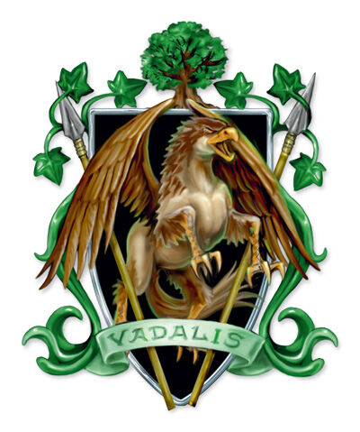

## House Vadalis
House Vadalis, where the Mark of Handling originally appeared about 2,000 years ago. The house's most significant trade is in the breeding and training of animals.

## Dragonmark
House Vadalis possesses the Mark of Handling. This mark grants various magical benefits related to calming and controlling animals. Vadalis has turned this into a booming trade in magebred animals. Everything from mounts to guards to pets can be bought from Vadalis stables. In addition to its animal husbandry, Vadalis stables are among the best in Korvhall, and the house also provides lines of communication to outposts too small to feature a House Sivis enclave.

## Membership
House Vadalis contains the Handlers Guild, though anyone working for the guild is not immediately considered a member of House Vadalis. House Vadalis does not treat itself as a noble house, much to the frustration of the other houses.

They are based out of Varna in the Eldeen Reaches, but have enclaves across the continent of Antiga.
