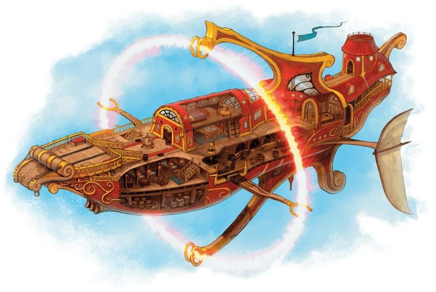

# Elemental airship
An airship is a ship produced by House Lyrandar that is allowed to fly through the air due to an Elemental Ring. While a few are owned by the nations of Khorvaire, the majority of airships are owned and operated by House Lyrandar.

## Known Airships
* Agate Star
  * "...an airship built for luxury...Her main deck boasted a grand pavilion containing a luxurious dining room, a lounge and even a small library, though Janik found nothing on it shelves to catch his interest. The deck had room for chairs, and the cabins below were spacious and comfortable."
  * "In place of the sunlight and chatter of luncheon time, the dining room was now dancing with candles and alive with the soft music of a small orchestra."[4]

* Beginner's Luck
  * "The Beginner's Luck is fairly typical of an average-sized elemental airship, and could represent any such vessel with only minor modifications. It has two levels below deck and a raised forecastle and sterncastle.

* Eye of the Storm

* Golden Dragon
  * This luxury air liner was originally commissioned as a massive Brelish war ship. After the end of the Last War, Lyrandar re-commissioned the vessel as a luxury liner with the finest outfittings. The ship is large enough that it requires two elemental bindings, both fire elementals, in addition to a separate water elemental binding. The combination of the secondary fire elemental and the water elemental are required to provide the extra lift.
  * "A floating airship fills the night sky...The housings for not one but two elemental rings surround the giant vessel - one blazing and crackling with flame, the other dormant and dark. The ship herself is near 200 feet long and over 60 feet across at her thickest. The Sovereign Host alone knows what device or artifice could keep such a behemoth aloft. Soarwood tinged with gold and carved with scale and talon motifs makes up her body. Her front bow is rendered into an enormous dragon's head with fanged mouth gaping wide."
  * Spa: "The serene lilt of a flute soothes the spirit as the scent of jasmine flower incense floats on the air. Woven bamboo mats and cushions line the floor of this elegantly decorated studio. Above a cushioned massage table, arcane designs and tapestries hang from the walls."
  * Casino: "This dimly lit chamber is alive with voices as guests crowd around various tables hurling dice or slapping down gold bars and coins. On one wall, a huge wheel in the shape of a dragon chasing its own tail spins incessantly, its glamered scales casting multi-colored light. Three elf women, each surpassing the next in beauty, sing from the stage, and the bar is tended by a portly halfling with a wide smile. Goblins in green tailed surcoats scamper about, bringing patrons their beverages and exchanging currency."

* Morning Zephyr

* River of Stars
