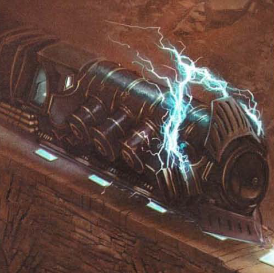

# Lightning Rail
Originally invented by House Cannith in 811 YK, the lightning rail follows a path of conductor stones, another Cannith invention. Said stones are placed along the ground by Orien's Trailblazers, forming a conduit of magical energy to allow the lightning rail to travel at high speeds across Khorvaire, generally at a steady rate of fourty miles per hour.

The lightning rail itself is pushed along by an elemental bound to the lightning rail's coaches, the elemental manifesting as a ring of electricity over the crew cart when active. High above the crew cart, a House Orien heir acts as the pilot by standing at the helm beneath the elemental's binding struts. Through the Mark of Passage, they are able to commune with and control the elemental, navigating by way of broad windows encircling the platform.

Despite being limited by the placement of conductor stones, the pilot still needs to control the rail's speed and, when lines are split in different directions, deduce which path to take.

Lightning Rail Stations are locations where the lightning rail regularly stops to load and unload passengers and cargo. These stations were built throughout Khorvaire between 811 and 845 YK, and linked all the Five Nations together until the Day of Mourning.

By the rules of House Orien, no lightning rail may stop anywhere other than at a designated station.
